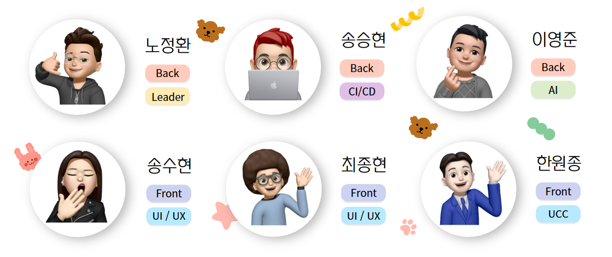
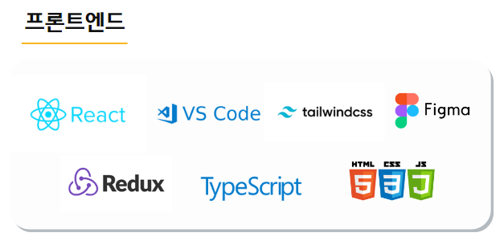
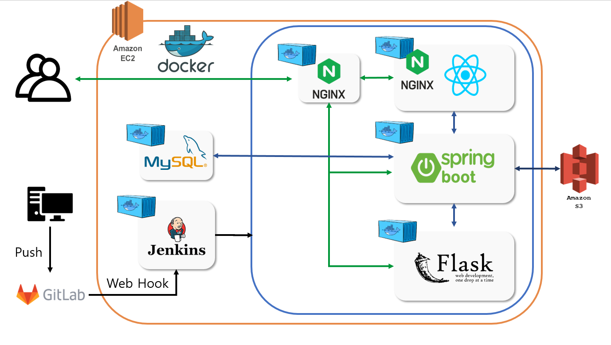
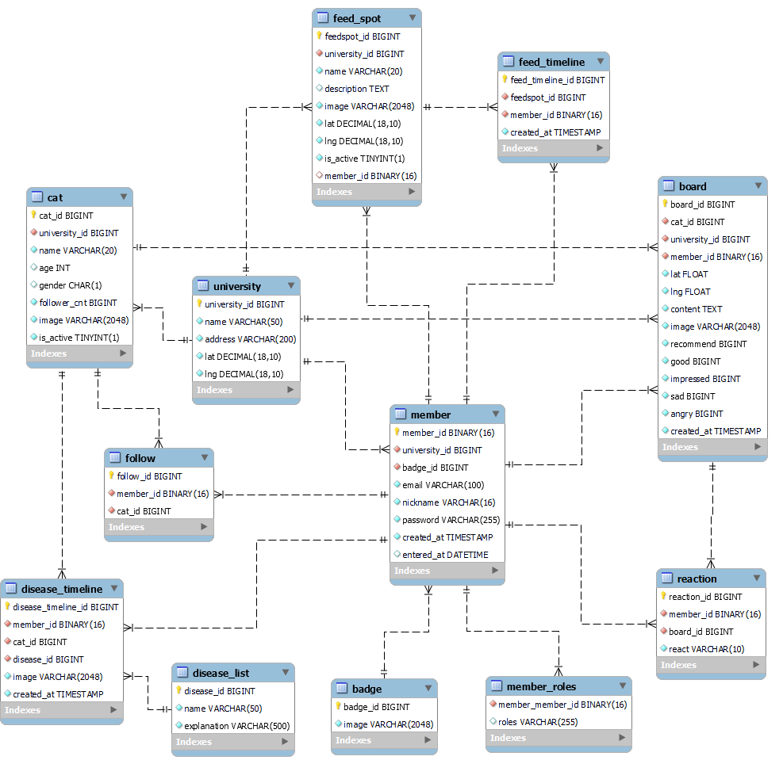
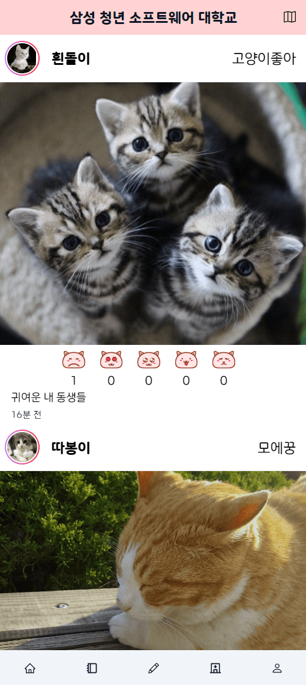

# 😻 모에모에냥 😻

## 🐾 모에모에냥 소개

<span style="color:#FF9393; font-size:18px">마음을 녹일 길냥이 서비스</span>
<br />
`모에모에냥` 프로젝트는 대학교 캠퍼스 별 길냥이 관리 서비스 입니다. <br/>
모에(燃え)란 어느 대상을 좋아하고, 대단한 흥미를 가지는 행위 및 그 상태를 의미합니다.<br/>
도시 생태계 일원인 길고양이들이 사랑받고 함께 공존하는 사회를 만들고 싶어 서비스를 기획하고 모에모에냥이라고 명명했습니다.<br />
<br />
모에모에냥은 모바일 웹 환경을 제공합니다. ( 권장 환경 : width = 390px, height = 844px )
<br /><br/>

## 🐾 프로젝트 기간 [ 6주 ]

2023.02.27(월) ~ 2023.04.07(금)
<br/><br/>

## 🐾 참여 인원 및 역할 분담



### Front-End

- **송수현** <br/>
  UI/UX 디자인 | 메인 페이지 | 마이 페이지 | 고양이 리스트 페이지 | 고양이 상세 페이지 | 질병 기록 페이지 | 병원 리스트 페이지

- **최종현** <br/>
  프로젝트 설계 | 랜딩 페이지 | 지도 페이지 | 고양이 리스트 위젯 | 게시글 슬라이드 위젯 | 지도/질병/게시글 등록 기능
- **한원종** <br/>
  중간 발표 | UI/UX 디자인 | 고양이 등록 페이지 | 질병 등록 페이지

### Back-End

- **노정환** <br/>
 팀장 | JWT를 활용한 사용자 인증,인가 | ERD 설계 | 사용자(Member), 급식소(Feed Spot), 질병 분석(Disease) API 설계 및 구현
- **이영준** <br/>
  인공지능 담당 | AI 모델 분석 | 데이터셋 전처리 | 모델 학습 및 테스트 | 플라스크 전체 구현 | Backend : Board 및 AI 관련 API 구현
- **송승현** <br/>
  서버 관리 | CI/CD | jira 관리 | ERD 설계 | 고양이 등록 , 리스트 조회, 팔/언팔로우, 상세정보, 최근위치 조회, 파일 업로드 API 구현
  <br/><br/>

## 🐾 개발 배경

길고양이가 사람들과 조화롭게 공존하기 위한 사회를 만들기 위해 해당 서비스를 기획했습니다. 길고양이는 시민들과 가까운 동물인 동시에, 도시의 쓰레기통을 헤집고 소음을 발생시켜 여러 갈등을 겪고 있습니다. 이러한 갈등을 해소하고 상생을 모색하기 위해 고양이에 대한 관심도, 참여도가 높은 대학생을 페르소나로 선정하고 캠퍼스 별 길냥이 관리 서비스를 개발했습니다.

<br/>

## 🐾 기대 효과

- 올바른 길냥이 돌봄 마련 온라인 커뮤니티 제공
- 고양이 급식소 관리(일정 시간 급여 및 위생 관리)로 인한 쓰레기 봉투 훼손 문제 해결
- 커뮤니티 기능을 통한 적정 사료 급여 및 급식소 위생 관리 가능
- 고양이 질병 기록(고양이 중성화, 피부병 등)을 통해 소음 방지, 무분별한 개체수 확장 방지 및 고양이 관리 가능
- 소통과 관리를 통한 동물 보호 인식 재고
  <br/><br/>

## 🐾 기술 스택

### Front-End



### Back-End


<br/><br/>

## 🐾 개발 환경

### Front-End

- React.JS: 18.2.0
- Redux Toolkit: 1.3.6
- TypeScript: 4.9.4
- Tailwindcss: 3.2.7
- React Router DOM: 6.9.0
- Axios: 1.3.4
- styled-components: 5.3.6
- React Icons: 4.1.0
- Node: 18.15.0

### Back-End

- Springboot : 2.7.8
- Java : zulu
- IntelliJ IDEA 2022.3.1 (Ultimate Edition)
- MySQL : 8.0.32
- JPA
- JWT
- S3

### CI/CD

- Jenkins
- EC2
- redis
- Docker, Docker compose

<br/>

## 🐾 아키텍처


<br/><br/>

## 🐾 ERD


<br/><br/>

## 🐾 기능 소개

**랜딩페이지**<br />

<br />

**고양이 커뮤니티**<br />

<br />

**대학교 캠퍼스 별 고양이 등록 및 관리**<br />


<br />

**대학교 캠퍼스 별 고양이 급식소 등록 및 관리**<br />


<br />

**고양이 질병 분석 및 기록**<br />

<br />

**마이 페이지**<br />

<br/><br/>

## 🐾 프로젝트 파일 구조

### Front-End

```
📦front-end
 ┣ 📂.storybook
 ┃ ┣ 📜main.js
 ┃ ┗ 📜preview.js
 ┣ 📂public
 ┃ ┣ 📂images
 ┃ ┃ ┣ 📂badgeImg
 ┃ ┃ ┣ 📂button
 ┃ ┃ ┣ 📂emoji
 ┃ ┃ ┣ 📂map
 ┣ 📂src
 ┃ ┣ 📂assets
 ┃ ┃ ┗ 📂fonts
 ┃ ┣ 📂common
 ┃ ┃ ┣ 📂footer
 ┃ ┃ ┣ 📂header
 ┃ ┣ 📂components
 ┃ ┃ ┣ 📂admin
 ┃ ┃ ┣ 📂board
 ┃ ┃ ┣ 📂cat
 ┃ ┃ ┣ 📂common
 ┃ ┃ ┣ 📂dropdown
 ┃ ┃ ┣ 📂lottie
 ┃ ┃ ┣ 📂map
 ┃ ┃ ┃ ┣ 📂bottom-contents
 ┃ ┃ ┣ 📂modal
 ┃ ┃ ┣ 📂mypage
 ┃ ┃ ┣ 📂upload
 ┃ ┣ 📂context
 ┃ ┣ 📂pages
 ┃ ┃ ┣ 📂board
 ┃ ┃ ┣ 📂cat
 ┃ ┃ ┣ 📂main
 ┃ ┃ ┣ 📂mypage
 ┃ ┃ ┣ 📂symptom
 ┃ ┣ 📂router
 ┃ ┣ 📂services
 ┃ ┃ ┣ 📂baord
 ┃ ┃ ┣ 📂cat
 ┃ ┃ ┣ 📂cats
 ┃ ┃ ┣ 📂LAGACY
 ┃ ┃ ┃ ┣ 📂mockdata
 ┃ ┃ ┣ 📂main
 ┃ ┃ ┣ 📂map
 ┃ ┃ ┣ 📂member
 ┃ ┃ ┣ 📂mypage
 ┃ ┃ ┣ 📂symptom
 ┃ ┣ 📂store
 ┃ ┣ 📂styles
 ┃ ┣ 📂utils
 ┗ ┗ ┗ 📂MockupService
```

### Back-End

```
📦back-end
 ┣ 📂gradle
 ┃ ┗ 📂wrapper
 ┣ 📂src
 ┃ ┣ 📂main
 ┃ ┃ ┣ 📂java
 ┃ ┃ ┃ ┗ 📂com
 ┃ ┃ ┃ ┃ ┗ 📂ssafy
 ┃ ┃ ┃ ┃ ┃ ┗ 📂moemoe
 ┃ ┃ ┃ ┃ ┃ ┃ ┣ 📂api
 ┃ ┃ ┃ ┃ ┃ ┃ ┃ ┣ 📂controller
 ┃ ┃ ┃ ┃ ┃ ┃ ┃ ┃ ┣ 📂auth
 ┃ ┃ ┃ ┃ ┃ ┃ ┃ ┃ ┣ 📂board
 ┃ ┃ ┃ ┃ ┃ ┃ ┃ ┃ ┣ 📂cat
 ┃ ┃ ┃ ┃ ┃ ┃ ┃ ┃ ┣ 📂feedspot
 ┃ ┃ ┃ ┃ ┃ ┃ ┃ ┃ ┣ 📂follow
 ┃ ┃ ┃ ┃ ┃ ┃ ┃ ┃ ┣ 📂member
 ┃ ┃ ┃ ┃ ┃ ┃ ┃ ┃ ┗ 📂university
 ┃ ┃ ┃ ┃ ┃ ┃ ┃ ┣ 📂request
 ┃ ┃ ┃ ┃ ┃ ┃ ┃ ┃ ┣ 📂board
 ┃ ┃ ┃ ┃ ┃ ┃ ┃ ┃ ┣ 📂cat
 ┃ ┃ ┃ ┃ ┃ ┃ ┃ ┃ ┣ 📂disease
 ┃ ┃ ┃ ┃ ┃ ┃ ┃ ┃ ┣ 📂feedspot
 ┃ ┃ ┃ ┃ ┃ ┃ ┃ ┃ ┣ 📂follow
 ┃ ┃ ┃ ┃ ┃ ┃ ┃ ┃ ┣ 📂member
 ┃ ┃ ┃ ┃ ┃ ┃ ┃ ┣ 📂response
 ┃ ┃ ┃ ┃ ┃ ┃ ┃ ┃ ┣ 📂auth
 ┃ ┃ ┃ ┃ ┃ ┃ ┃ ┃ ┣ 📂board
 ┃ ┃ ┃ ┃ ┃ ┃ ┃ ┃ ┣ 📂cat
 ┃ ┃ ┃ ┃ ┃ ┃ ┃ ┃ ┣ 📂disease
 ┃ ┃ ┃ ┃ ┃ ┃ ┃ ┃ ┣ 📂feedspot
 ┃ ┃ ┃ ┃ ┃ ┃ ┃ ┃ ┣ 📂member
 ┃ ┃ ┃ ┃ ┃ ┃ ┃ ┃ ┣ 📂university
 ┃ ┃ ┃ ┃ ┃ ┃ ┃ ┗ 📂service
 ┃ ┃ ┃ ┃ ┃ ┃ ┃ ┃ ┣ 📂board
 ┃ ┃ ┃ ┃ ┃ ┃ ┃ ┃ ┣ 📂cat
 ┃ ┃ ┃ ┃ ┃ ┃ ┃ ┃ ┣ 📂disease
 ┃ ┃ ┃ ┃ ┃ ┃ ┃ ┃ ┣ 📂feedspot
 ┃ ┃ ┃ ┃ ┃ ┃ ┃ ┃ ┣ 📂follow
 ┃ ┃ ┃ ┃ ┃ ┃ ┃ ┃ ┣ 📂member
 ┃ ┃ ┃ ┃ ┃ ┃ ┃ ┃ ┃ ┣ 📂impl
 ┃ ┃ ┃ ┃ ┃ ┃ ┃ ┃ ┣ 📂university
 ┃ ┃ ┃ ┃ ┃ ┃ ┣ 📂common
 ┃ ┃ ┃ ┃ ┃ ┃ ┃ ┣ 📂auth
 ┃ ┃ ┃ ┃ ┃ ┃ ┃ ┣ 📂model
 ┃ ┃ ┃ ┃ ┃ ┃ ┃ ┣ 📂util
 ┃ ┃ ┃ ┃ ┃ ┃ ┣ 📂config
 ┃ ┃ ┃ ┃ ┃ ┃ ┃ ┣ 📂security
 ┃ ┃ ┃ ┃ ┃ ┃ ┣ 📂db
 ┃ ┃ ┃ ┃ ┃ ┃ ┃ ┣ 📂dto
 ┃ ┃ ┃ ┃ ┃ ┃ ┃ ┣ 📂entity
 ┃ ┃ ┃ ┃ ┃ ┃ ┃ ┃ ┣ 📂board
 ┃ ┃ ┃ ┃ ┃ ┃ ┃ ┃ ┣ 📂cat
 ┃ ┃ ┃ ┃ ┃ ┃ ┃ ┃ ┣ 📂disease
 ┃ ┃ ┃ ┃ ┃ ┃ ┃ ┃ ┣ 📂feedspot
 ┃ ┃ ┃ ┃ ┃ ┃ ┃ ┃ ┣ 📂follow
 ┃ ┃ ┃ ┃ ┃ ┃ ┃ ┃ ┣ 📂member
 ┃ ┃ ┃ ┃ ┃ ┃ ┃ ┃ ┗ 📂university
 ┃ ┃ ┃ ┃ ┃ ┃ ┃ ┗ 📂repository
 ┃ ┃ ┃ ┃ ┃ ┃ ┃ ┃ ┣ 📂board
 ┃ ┃ ┃ ┃ ┃ ┃ ┃ ┃ ┣ 📂cat
 ┃ ┃ ┃ ┃ ┃ ┃ ┃ ┃ ┣ 📂disease
 ┃ ┃ ┃ ┃ ┃ ┃ ┃ ┃ ┣ 📂feedspot
 ┃ ┃ ┃ ┃ ┃ ┃ ┃ ┃ ┣ 📂follow
 ┃ ┃ ┃ ┃ ┃ ┃ ┃ ┃ ┣ 📂member
 ┃ ┃ ┃ ┃ ┃ ┃ ┃ ┃ ┣ 📂university
 ┃ ┃ ┃ ┃ ┃ ┃ ┗ 📂exception
 ┃ ┃ ┗ 📂resources
 ┃ ┗ 📂test
 ┃ ┃ ┣ 📂java
 ┗ ┗ ┗ 📂resources
```

<br/><br/>
